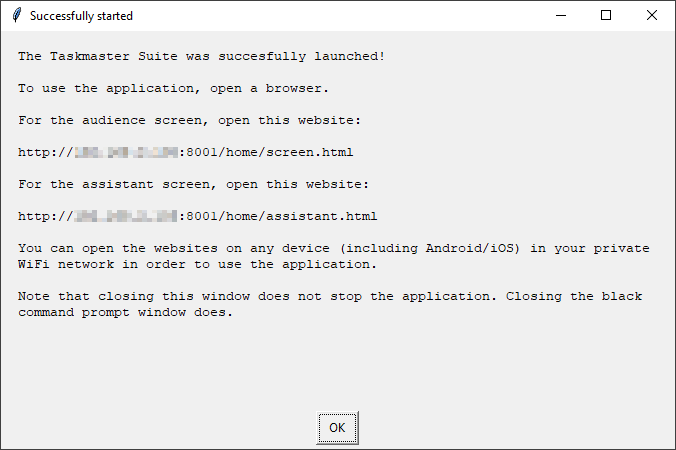
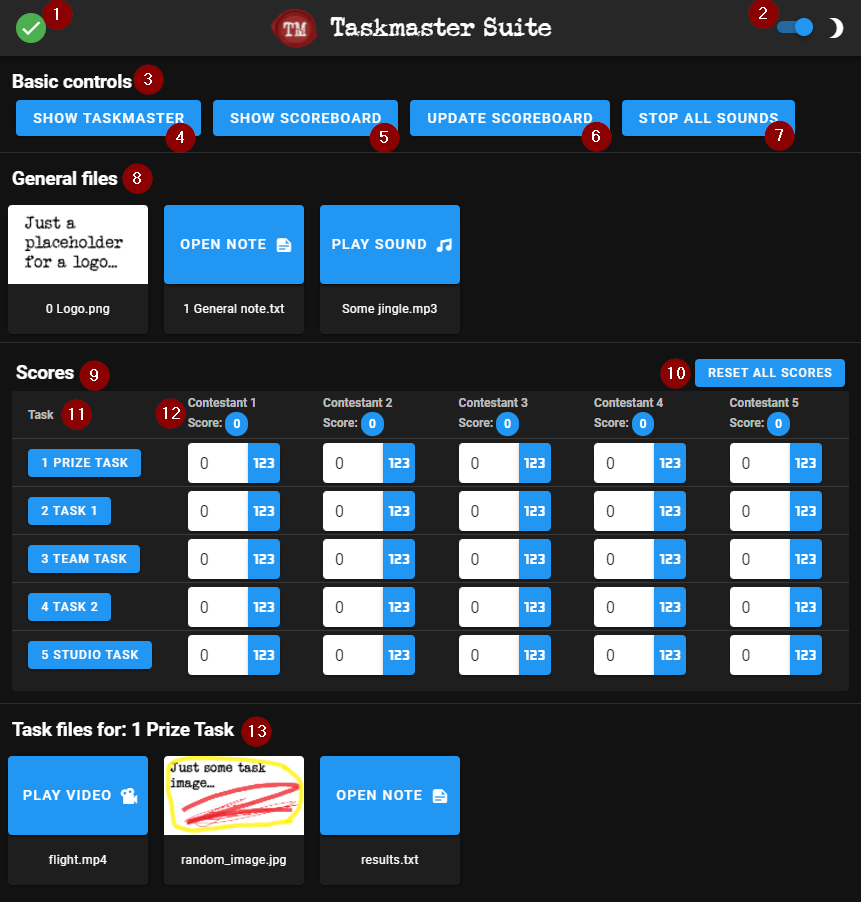

# Taskmaster Suite
Nice to see you, yes it is! Welcome to the Taskmaster Suite project, a fun little private project which shall allow you to control a screen for an audience using a controller website, much like Alex Horne and his international counterparts are doing it on the famous TV show Taskmaster.

## Quickstart
All you need is
- a Windows computer (exception: you are capable of running a python application yourself in which case you can check out the section [`Mac and Linux support`](#mac-and-linux-support) below),
- to download the files from the [latest release](https://github.com/LocoMH/TaskmasterSuite/releases/latest),
- to extract the downloaded files to an arbitrary location on your computer and finally
- to run `server.exe`. The next steps will be displayed in this window:



There are two websites: The assistant screen and the audience screen. The assistant screen controls the audience screen. That's really all.

Note that this application was tested on Windows 10 and an up-to-date version of Chrome browser. There are no known incompatibility issues, though the older a browser/operating system is, the less likely it is to run smoothly. Make sure to check out the [`FAQs`](#faqs) below first before filing an issue.

## Description of assistant screen


1. This is either a red cross or a green check mark, letting you know whether the website is connected to the server which you are running (`server.exe`).
2. Change between light and dark mode here.
3. Quick navigation buttons help you to get to the section you need quickly.
4. Section `Basic controls`: As of now, there are four buttons here (points 5.-8.).
5. Show taskmaster: Will show the taskmaster image on the audience screen (the one which is shown when you open the audience screen the first time).
6. Show scoreboard: Will show the scoreboard with all contestants and their current scores.
7. Update scoreboard: Having distributed the scores, the assistant can click this button and the contestants get their scores updated on the audience screen and switch places.
8. Stop all sounds: In case any sound is playing, it is stopped using this button.
9. Section `General files`: Any files which you have placed into the `data` directory. More information on how to set the files can be found below in the section [`Alter files`](#alter-files).
10. An example for an image file. Click on the image to show it on the audience screen.
11. An example for a note file. Click on it to see the note on the assistant screen.
12. An example for a sound file. Click on Play Sound to play the sound once.
13. Click on Loop Sound to play the sound in a loop.
14. Section `Scores`: Table with tasks and contestants and the respective scores.
15. Reset all scores: Will set all scores to 0 after reconfirmation.
16. All tasks are listed in the table vertically.
17. All contestants are listed in the table horizontally. You can also see the total score (sum of all task scores) for each contestant.
18. Clicking on a task will open it in the section `Task files for: <Task name>` (see point 20).
19. Scores can be given in two ways: Either directly via the text field or by clicking on the "123" button and using the quick buttons for scores 0 to 6.
20. Section `Task files for: <Task name>`: Any files which are related to a specific task. Choose the task by clicking on the button in the table above. More information on how to set the files can be found below in the section [`Alter files`](#alter-files).
21. An example for a video file. Click on it to play the video on the audience screen.
22. Section `Notes`: One text area which you can fill according to your needs.
23. Slider to change the size of the note text area.
24. Note text area.

## Alter files
You can change almost anything to make the application show the images and videos that you want. The only time you ever need to reload the audience website is after you've changed any of the following:
- Background image,
- the seal image,
- a frame image,
- the taskmaster image or
- contestants.

### Backgrounds, seal, frames
Go to `data/backgrounds` and replace the images to your likings. Note that the names **must** be identical to the initial names (i.e. also the file types must be identical at this point).

### Contestants
Go to `data/contestants` and replace the images with the contestants of your event. Name them appropriately. The application takes care of the rest.

### Tasks
Go to `data/tasks` and create one directory per task. Name them any way you like, but know that they will be sorted alphabetically on the assistant screen.

### Taskmaster
Go to `data` and replace the `taskmaster.png` image with your event's taskmaster. Note that the file name **must** be `taskmaster`, but the file extension can be *.png, *.jpg, *.jpeg, *.bmp or *.gif.

### Images (general)
You can place any images (with any name and of types *.png, *.jpg, *.jpeg, *.bmp or *.gif) into the `data` directory. They will appear in the section `General files` of the assistant screen.

### Images (task-related)
You can place any images (with any name and of types *.png, *.jpg, *.jpeg, *.bmp or *.gif) into the `data/tasks/<Task name>` directories. They will appear in the section `Task files for:` of the assistant screen once you've selected a task by clicking on the task's button.

### Videos
The same as for `Images (general)` and `Images (task-related)` applies. The only allowed file extension is *.mp4.

### Sounds
The same as for `Images (general)` and `Images (task-related)` applies. The only allowed file extension is *.mp3.

### Notes
The same as for `Images (general)` and `Images (task-related)` applies. The only allowed file extension is *.txt. Notes will never appear on the audience screen. They are purely for the taskmaster's assistant, e.g. to read out times, quotes or anything else you want.

## Mac and Linux support
As of now, the official releases contain only a Windows version. However as this project relies heavily on Python, it is not a big problem to run it also on Mac or Linux. You do need basic Python skills, though. Please do note that due to an absolute lack of Mac knowledge, an official and easy to use (i.e. without Python knowledge) Mac release depends strongly on support from the outside. Maybe you can help?

In order to install the necessary packages, browse to sources/app and install the project via

```pip install .```

Of course I can only recommend to use a virtual environment for this.
Once installed, simply execute

```serve```

to start the application.

## FAQs
> Q: Why do videos not play for me?
> 
> A: In order to prevent videos from randomly playing on a website, some browsers require some interaction with a website before videos can start to play on their own. Therefore, after opening the screen.html website, simply click somewhere on the website, this is considered as interaction. Afterwards, videos will be allowed to play.

> Q: Why is there a lag when showing images/playing videos?
> 
> A: This is because they must be loaded and it only appears when showing an image for the first time. Depending on your network speed, the lag can be noticeable or less so. One thing which helps is to show all images once before your event starts so they are loaded into cache. Then the lag should be gone.

> Q: There is a lag when showing images.
> 
> A: This is because they must be loaded and it only appears when showing an image for the first time. Depending on your network speed, the lag can be noticeable or less so. One thing which helps is to show all images once before your event starts so they are loaded into cache. Then the lag should be gone.

> Q: I think I've found a bug, how can I let you know?
> 
> A: The easiest way will be to register the potential issue right here and describe it as precisely as possible: https://github.com/LocoMH/TaskmasterSuite/issues/new. Thanks!

> Q: I have an idea for a cool new feature, how can I let you know?
> 
> A: Just like for bugs, please register the idea here and describe it as precisely as possible: https://github.com/LocoMH/TaskmasterSuite/issues/new. Thanks!

> Q: The websites don't seem to be loading properly.
> 
> A: Please note that due to external dependencies you will need an internet connection at least upon opening the websites. Later on it may be cached, I haven't tried that particular case.
